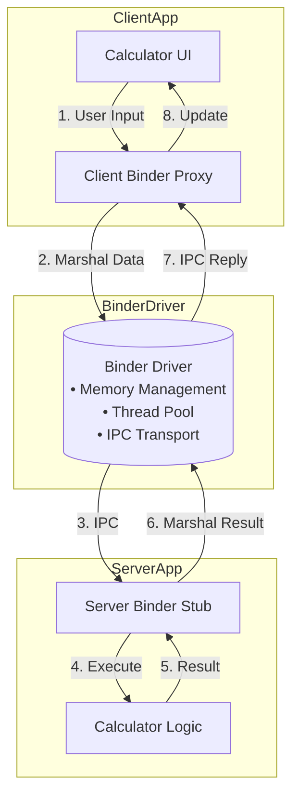
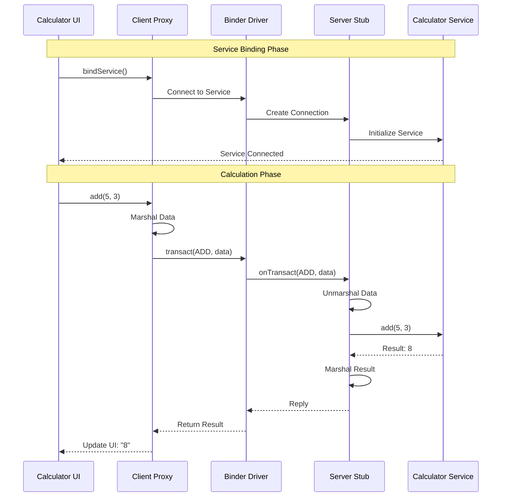
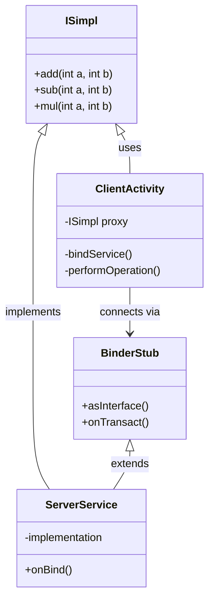
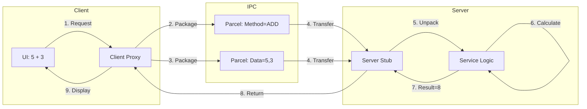

# AIDL

In this guide, we'll walk through the process of using **AIDL (Android Interface Definition Language)** to enable **Inter-Process Communication (IPC)** between a client and a server in Android applications. AIDL facilitates communication between components running in different processes, even across different apps, using **Binder IPC**. We'll cover everything from defining an AIDL interface to setting up both the client and server, handling permissions, and addressing common issues you might encounter along the way. By the end, you'll have a solid understanding of how to leverage AIDL in your Android projects.

---

## Table of Contents

#### [1. What is AIDL?](#1-what-is-aidl)
  - [Why is AIDL Needed?](#why-is-aidl-needed)

#### [2. Creating the AIDL Interface](#2-creating-the-aidl-interface)
  - [Create the AIDL File](#create-the-aidl-file)
  - [Generated Code from AIDL](#generated-code-from-aidl)

#### [3. Setting Up the Server Application](#3-setting-up-the-server-application)
  - [Service Implementation](#service-implementation)
  - [Register the Service in the Manifest](#register-the-service-in-the-manifest)

#### [4. Setting Up the Client Application](#4-setting-up-the-client-application)
  - [Client App Implementation](#client-app-implementation)

#### [5. Binding the Service](#5-binding-the-service)

#### [6. Handling Permissions](#6-handling-permissions)
  - [Server App Permissions](#server-app-permissions)
  - [Client App Permissions](#client-app-permissions)

#### [7. Common Issues](#7-common-issues)

#### [8. Advanced Topics](#8-advanced-topics)
  - [Handling Arrays in AIDL](#handling-arrays-in-aidl)
  - [Asynchronous Services](#asynchronous-services)

#### [9. Understanding AIDL and Binder Internals](#9-understanding-aidl-and-binder-internals)
  - [How Binder IPC Works](#how-binder-ipc-works)
  - [AIDL Generated Code Deep Dive](#aidl-generated-code-deep-dive)
  - [Binder Death Notification](#binder-death-notification)
  - [Performance Considerations](#performance-considerations)
  - [Security Mechanisms](#security-mechanisms)

#### [10. Understanding the Calculator Example Flow](#10-understanding-the-calculator-example-flow)
  - [Architecture Overview](#architecture-overview)
  - [Detailed Communication Flow](#detailed-communication-flow)
  - [Component Responsibilities](#component-responsibilities)
  - [Data Flow Example: Addition Operation](#data-flow-example-addition-operation)

---

### 1\. What is AIDL?

**AIDL (Android Interface Definition Language)** is a tool used to define the interfaces for communication between Android applications and services running in different processes. It allows a client (such as an app or component) to communicate with a service, even if the service is running in a different process or application. AIDL simplifies inter-process communication by allowing developers to define remote interfaces that the client and server can agree on.

AIDL uses the **Binder IPC** mechanism to facilitate communication. This means that AIDL can send data across processes by "marshalling" (packing) data into a format that can be transmitted and "demarshalling" (unpacking) it at the receiving end.

#### Why is AIDL Needed?

In Android, each application runs in its own process, with its own memory space, making direct communication between processes impossible. AIDL helps in defining interfaces that allow the transfer of data between processes, and it automatically handles the marshalling and demarshalling process for complex objects.

* **Marshalling**: The process of breaking down an object into basic data types that can be transmitted.
    
* **Demarshalling**: The process of reconstructing an object from the basic data types on the receiving side.
    

AIDL provides a simplified abstraction layer to help developers interact with services in other processes.

---

### 2\. Creating the AIDL Interface

Creating an AIDL interface is the first step in enabling IPC between a client and a service. In this section, we will define a simple AIDL interface for basic arithmetic operations.

#### Create the AIDL File

```java
// ISimpl.aidl
package com.dilip.aidlserver;

// Interface defining the contract between client and server
interface ISimpl {
    // Basic arithmetic operations that can be called remotely
    int add(int a, int b);    // Adds two integers
    int sub(int a, int b);    // Subtracts second integer from first
    int mul(int a, int b);    // Multiplies two integers
}
```

#### Generated Code from AIDL

Once you build the `.aidl` file, Android Studio automatically generates a Java interface file. Here's a simplified version of the generated `ISimpl.java`:

```java
package com.dilip.aidlserver;

public interface ISimpl extends android.os.IInterface {
    // Descriptor used for binder identification
    public static final String DESCRIPTOR = "com.dilip.aidlserver.ISimpl";
    
    // Method declarations that can throw RemoteException
    public int add(int a, int b) throws android.os.RemoteException;
    public int sub(int a, int b) throws android.os.RemoteException;
    public int mul(int a, int b) throws android.os.RemoteException;

    // Default implementation class
    public static class Default implements ISimpl {
        @Override public int add(int a, int b) { return 0; }
        @Override public int sub(int a, int b) { return 0; }
        @Override public int mul(int a, int b) { return 0; }
        @Override public android.os.IBinder asBinder() { return null; }
    }

    // Binder implementation (server-side)
    public static abstract class Stub extends android.os.Binder implements ISimpl {
        public static ISimpl asInterface(android.os.IBinder obj) {
            // ... converts IBinder to ISimpl interface
            return new Proxy(obj);
        }

        // Handles incoming transactions
        @Override public boolean onTransact(int code, android.os.Parcel data,
                                          android.os.Parcel reply, int flags) {
            switch (code) {
                case TRANSACTION_add: {
                    // Read parameters
                    int arg0 = data.readInt();
                    int arg1 = data.readInt();
                    // Perform operation
                    int result = this.add(arg0, arg1);
                    // Write result
                    reply.writeInt(result);
                    return true;
                }
                // Similar cases for sub and mul
            }
            return super.onTransact(code, data, reply, flags);
        }

        // Proxy class for client-side implementation
        private static class Proxy implements ISimpl {
            private android.os.IBinder mRemote;

            @Override public int add(int a, int b) throws android.os.RemoteException {
                // Prepare data parcel
                android.os.Parcel _data = android.os.Parcel.obtain();
                android.os.Parcel _reply = android.os.Parcel.obtain();
                try {
                    // Write parameters
                    _data.writeInt(a);
                    _data.writeInt(b);
                    // Make remote call
                    mRemote.transact(TRANSACTION_add, _data, _reply, 0);
                    // Read and return result
                    return _reply.readInt();
                } finally {
                    _reply.recycle();
                    _data.recycle();
                }
            }
            // Similar implementations for sub and mul
        }
    }
}
```
The `Stub` class extends `Binder` and serves as a bridge between the client and the service, while the 
`Proxy` class is used on the client side to call the service methods.
This generated code handles all the IPC mechanics:
- The `Stub` class implements the server-side logic
- The `Proxy` class handles client-side communication
- `Parcel` objects are used to marshal data between processes
- Transaction codes identify which method is being called

---

### 3\. Setting Up the Server Application

The server application implements the AIDL interface and exposes its functionality via a service. This service will handle the actual logic (in this case, arithmetic operations) and provide it to the client.

#### Service Implementation

```kotlin
// MyService.kt (Server-side)
class MyService : Service() {
    override fun onBind(intent: Intent): IBinder {
        // Create and return a Binder implementation that handles the actual operations
        return object : ISimpl.Stub() {
            // Implementation of the AIDL interface methods
            override fun add(a: Int, b: Int): Int = a + b
            override fun sub(a: Int, b: Int): Int = a - b
            override fun mul(a: Int, b: Int): Int = a * b
        }
    }
}
```

#### Register the Service in the Manifest

```xml
<service android:name=".MyService" android:exported="true">
    <intent-filter>
        <action android:name="com.dilip.aidlserver.AIDL" />
    </intent-filter>
</service>
```

The `intent-filter` allows the service to be accessible via the specified action name.

---

### 4\. Setting Up the Client Application

The client application will bind to the server service and invoke the methods defined in the AIDL interface.

#### Client App Implementation

```kotlin
class MainActivity : ComponentActivity() {
    // Hold reference to the remote service interface
    private var simpl: ISimpl? = null
    // Track service connection state using Compose state
    private var isBound by mutableStateOf(false)
    // Store calculation results for UI display
    private var resultText by mutableStateOf("Result will appear here")

    // Connection callback for service binding
    private val serviceConnection = object : ServiceConnection {
        override fun onServiceConnected(name: ComponentName?, service: IBinder?) {
            // Convert the IBinder to our AIDL interface
            simpl = ISimpl.Stub.asInterface(service)
            isBound = true
            showToast("Service Bound")
        }

        override fun onServiceDisconnected(name: ComponentName?) {
            // Clean up when service disconnects
            simpl = null
            isBound = false
        }
    }

    private fun bindService() {
        if (!isBound) {
            // Create explicit intent to bind to the server service
            val intent = Intent("com.dilip.aidlserver.AIDL").apply {
                setPackage("com.dilip.aidlserver")  // Required for Android security
            }
            bindService(intent, serviceConnection, BIND_AUTO_CREATE)
        }
    }

    private fun performOperation(operation: String, firstValue: String, secondValue: String) {
        if (isBound) {
            try {
                // Convert string inputs to integers, defaulting to 0 if invalid
                val num1 = firstValue.toIntOrNull() ?: 0
                val num2 = secondValue.toIntOrNull() ?: 0
                
                // Call the appropriate remote method based on operation
                val result = when (operation) {
                    "add" -> simpl?.add(num1, num2)
                    "sub" -> simpl?.sub(num1, num2)
                    "mul" -> simpl?.mul(num1, num2)
                    else -> 0
                }
                // Update UI with result
                resultText = "$operation result: $result"
            } catch (e: RemoteException) {
                // Handle remote procedure call errors
                e.printStackTrace()
                showToast("Error in operation")
            }
        }
    }
}
```

This code binds the client app to the server service using an explicit `Intent`, connects the service, and calls methods like `add()`, `sub()`, and `mul()` remotely.

---

### 5\. Binding the Service

To bind to the service, you need an **explicit intent**. This means you must provide the exact action name defined in the server app's manifest. Here's how you do it:

```kotlin
val intent = Intent("com.dilip.aidlserver.AIDL")
bindService(intent, serviceConnection, BIND_AUTO_CREATE)
```

Once the service is bound, the `onServiceConnected()` callback is triggered, and the client can start calling the remote methods.

---

### 6\. Handling Permissions

When working with AIDL across multiple apps, permissions are essential to ensure that only authorized apps can access the service.

#### Server App Permissions

In the server app, you may define a custom permission to restrict access to the service:

```xml
<permission 
    android:name="com.dilip.aidlserver.permission.BIND" 
    android:protectionLevel="signature" />
```

#### Client App Permissions

In the client app, you must declare the permission in the `AndroidManifest.xml` to request access to the service:

```xml
<uses-permission android:name="com.dilip.aidlserver.permission.BIND" />
```

Without the proper permissions, the client app will not be able to bind to the server service.

---

### 7\. Common Issues

Here are a few common issues developers face when working with AIDL:

1. **Service Not Binding**:
    
    * **Cause**: Incorrect intent action or missing service declaration in `AndroidManifest.xml`.
        
    * **Solution**: Ensure the intent action in the client matches the service action in the manifest.
        
2. **RemoteException**:
    
    * **Cause**: Mismatched types or method signatures.
        
    * **Solution**: Double-check that the method signatures are consistent between the client and the server.
        
3. **Permissions Issues**:
    
    * **Cause**: Missing permissions in the manifest.
        
    * **Solution**: Ensure both the client and server apps have the required permissions to communicate.
        

---

### 8\. Advanced Topics

#### Handling Arrays in AIDL

AIDL can handle arrays and collections using the `in`, `out`, and `inout` keywords. For example:

```java
// IArrayExample.aidl
interface IArrayExample {
    // 'in' parameter means the array is read-only in the service
    int[] processArray(in int[] input);
    // 'inout' allows the service to modify the array
    void updateArray(inout int[] data);
}
```

#### Asynchronous Services

AIDL supports asynchronous methods with the `oneway` keyword. This is useful for long-running operations that shouldn't block the main thread.

```java
// IAsync.aidl
// 'oneway' indicates this method won't block the caller
oneway interface IAsync {
    // Asynchronous processing of array data
    void processAsync(in int[] data);
}
```

---

### 9\. Understanding AIDL and Binder Internals

#### How Binder IPC Works

The Binder IPC mechanism consists of several key components:
```kotlin
// The Binder driver (/dev/binder) handles the low-level IPC
// It manages:
- Memory allocation and mapping between processes
- Thread management for IPC operations
- Reference counting of Binder objects
```

2. **Transaction Process**
```java
// Simplified view of a Binder transaction
class BinderTransaction {
    // Each transaction has a unique ID
    int transactionCode;
    // Data being sent
    Parcel data;
    // Response data
    Parcel reply;
    // Target interface descriptor
    String interfaceDescriptor;
}
```

#### AIDL Generated Code Deep Dive

Let's examine the key components of the generated code:

1. **Transaction Codes**
```java
// Each method gets a unique transaction code
public static final int TRANSACTION_add = IBinder.FIRST_CALL_TRANSACTION + 0;
public static final int TRANSACTION_sub = IBinder.FIRST_CALL_TRANSACTION + 1;
public static final int TRANSACTION_mul = IBinder.FIRST_CALL_TRANSACTION + 2;
```

2. **Marshalling Process**
```java
// Client-side marshalling (in Proxy class)
public int add(int a, int b) throws RemoteException {
    // Create data containers
    Parcel data = Parcel.obtain();  // For sending
    Parcel reply = Parcel.obtain(); // For receiving
    try {
        // Write method identifier
        data.writeInterfaceToken(DESCRIPTOR);
        // Marshal parameters
        data.writeInt(a);
        data.writeInt(b);
        // Make the actual IPC call
        mRemote.transact(TRANSACTION_add, data, reply, 0);
        // Check for errors
        reply.readException();
        // Unmarshal the result
        return reply.readInt();
    } finally {
        // Clean up
        reply.recycle();
        data.recycle();
    }
}
```

3. **Server-side Processing**
```java
// In Stub class
@Override
public boolean onTransact(int code, Parcel data, Parcel reply, int flags) {
    switch (code) {
        case TRANSACTION_add: {
            // Verify caller
            data.enforceInterface(DESCRIPTOR);
            // Unmarshal parameters
            int arg0 = data.readInt();
            int arg1 = data.readInt();
            // Execute actual implementation
            int result = this.add(arg0, arg1);
            // Write response
            reply.writeNoException();
            reply.writeInt(result);
            return true;
        }
    }
}
```

#### Binder Death Notification

AIDL provides mechanisms to handle process death:

```kotlin
private val deathRecipient = object : IBinder.DeathRecipient {
    override fun binderDied() {
        // Handle service death
        simpl = null
        isBound = false
        // Attempt reconnection if needed
        bindService()
    }
}

override fun onServiceConnected(name: ComponentName?, service: IBinder?) {
    simpl = ISimpl.Stub.asInterface(service)
    // Register for death notifications
    service?.linkToDeath(deathRecipient, 0)
}
```

#### Performance Considerations

1. **Data Transfer**
```kotlin
// Binder has a transaction buffer limit (1MB - 8MB depending on device)
const val BINDER_TRANSACTION_LIMIT = 1024 * 1024 // 1MB

// For large data, consider:
1. Chunking the data
2. Using ParcelFileDescriptor
3. ContentProvider or other alternatives
```

2. **Thread Management**
```kotlin
// Binder threads are managed by the system
// Each process has a thread pool (default max: 16)
class BinderThreadPool {
    // System manages creation/destruction
    val maxThreads = 16
    // Threads are created on-demand
    val activeThreads = mutableListOf<Thread>()
}
```

#### Security Mechanisms

1. **Identity Checking**
```java
// In service implementation
public int add(int a, int b) {
    // Get caller's identity
    int callingPid = Binder.getCallingPid();
    int callingUid = Binder.getCallingUid();
    
    // Verify caller's permissions
    if (checkPermission(callingPid, callingUid)) {
        return a + b;
    }
    throw new SecurityException("Caller not authorized");
}
```

2. **Token Validation**
```kotlin
// Optional security token implementation
private val securityToken = UUID.randomUUID().toString()

// Add to interface
interface ISecureSimpl {
    boolean authenticate(String token);
    int add(int a, int b, String token);
}
```

This internal understanding helps when:
- Debugging IPC issues
- Optimizing performance
- Implementing security measures
- Handling edge cases and errors

---

### 10\. Understanding the Calculator Example Flow

#### Architecture Overview



#### Detailed Communication Flow



#### Component Responsibilities



#### Data Flow Example: Addition Operation



These diagrams illustrate:
1. The overall architecture of our AIDL calculator
2. The sequence of events during service binding and calculation
3. The relationship between different components
4. The detailed data flow for a single calculation operation

The process shows how:
- User input from the UI is transformed into IPC calls
- Data is marshalled and unmarshalled across process boundaries
- The server processes the request and returns results
- Results are propagated back to the UI

---

